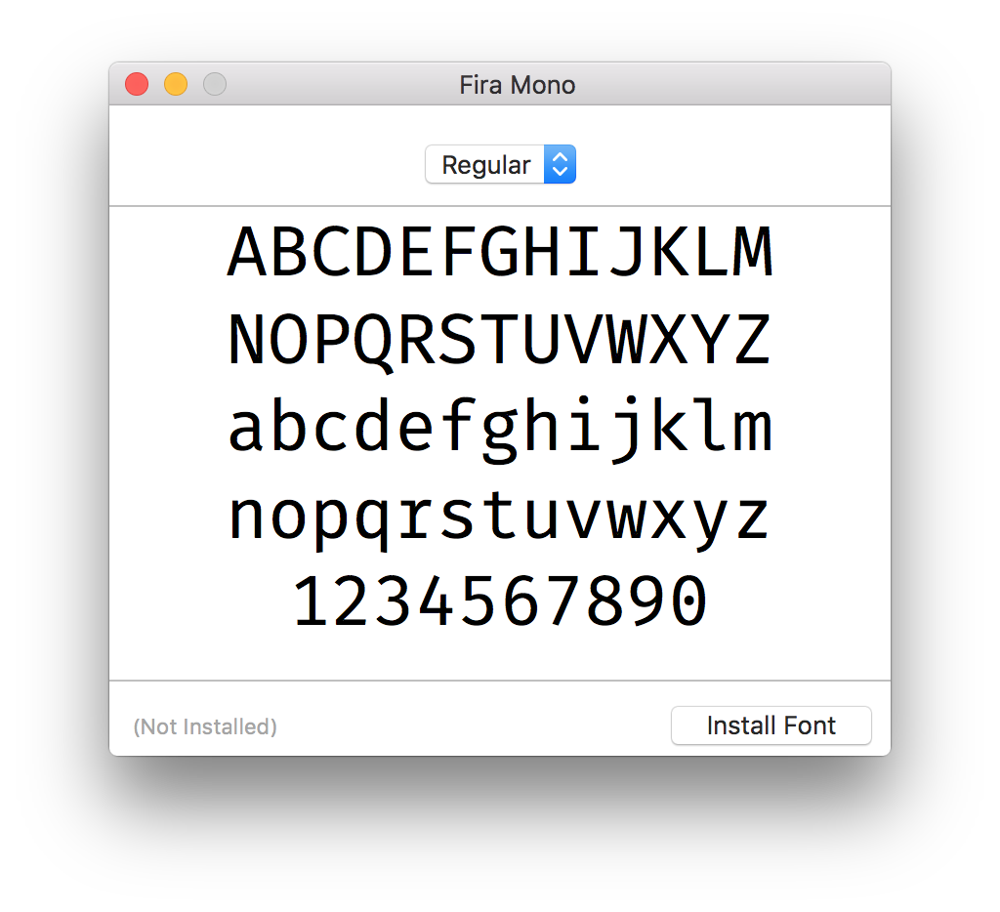

A version of [Fira Mono](https://github.com/mozilla/Fira) with an alternate lowercase "r". The alternate glyph was already present in the `FiraMono.glyphs` file, but Mr. Spiekermann decided to use the ugly one.